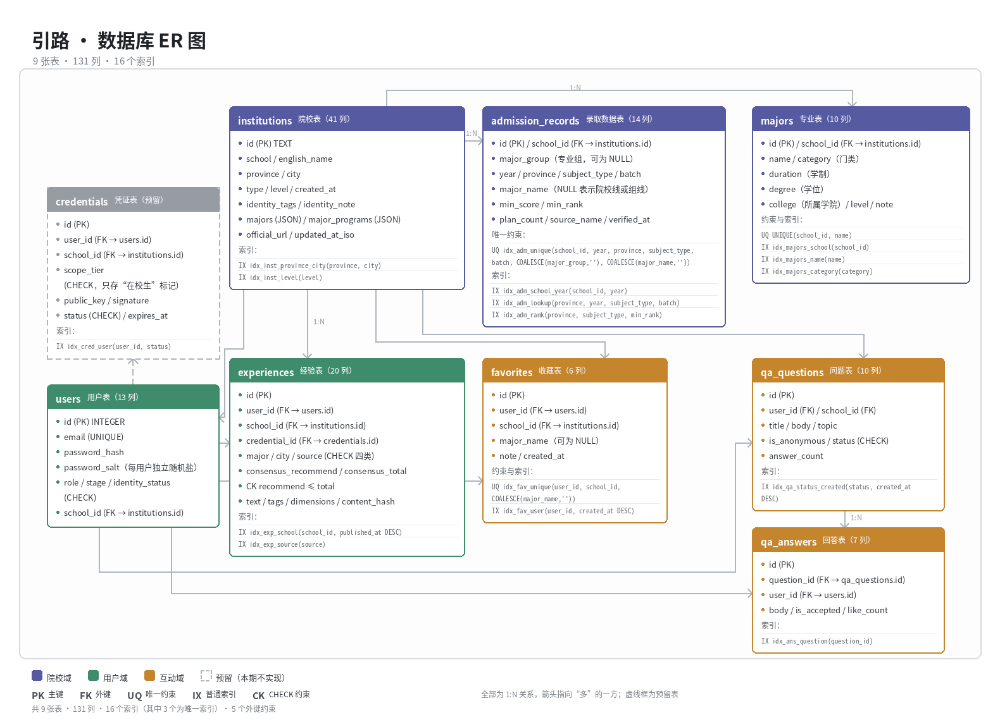

# 引路 · 数据库设计说明书

编写：P9
版本：v1.2
日期：2026-09-28
状态：纸上设计，本次不写后端代码，后端实现推迟到 10 月中旬以后
目标路径：`docs/数据库设计/数据库设计说明书.md`（本机先存在交付包目录，待提交）
依据：仓库 `v3` 分支源码 `js/01-data-experiences.js`、`js/02-data-institutions.js`、`js/03-config-constants.js`

本版修订情况：

- v1.1：`admissions` 改名为 `admission_records`；录取表新增 `major_group`（专业组）字段；新增独立的 `majors` 专业表，含学制与学位；`institutions` 增加 `created_at`；录取表的唯一约束原先在 NULL 情况下会失效，改用 `COALESCE` 表达式唯一索引；表数由 8 张增加到 9 张，索引由 12 个增加到 16 个。
- v1.2：补充 4.1 节的多专业组查询口径、4.2 节的 JSON 列拆表判据、4.3 节的数据版本管理流程，以及 6.5 节的结构版本号约定。

---

## 一、技术选型

| 阶段 | 选型 | 理由 |
|---|---|---|
| 开发 / 院赛演示 | SQLite | 零配置、单文件、双击即跑，与项目"零依赖"的策略一致，也省掉了 Docker、Redis 这类部署负担 |
| 生产（复赛以后） | MySQL 或 PostgreSQL | 字段类型与约束可以平滑迁移；本设计统一使用窄类型，避免被 SQLite 的方言锁死 |

需要说明的是，项目目前的技术栈是纯静态的，网站部署在 GitHub Pages 上，而 GitHub Pages 跑不了 Node 服务器。所以国庆期间不搭建后端，只产出设计方案。

---

## 二、表结构清单（9 张表）

| # | 表名 | 中文 | 依赖 | 说明 |
|---|---|---|---|---|
| 1 | `institutions` | 院校表 | — | 院校档案，41 列 |
| 2 | `majors` | 专业表 | `institutions` | 结构化专业档案，10 列 |
| 3 | `admission_records` | 录取数据表 | `institutions` | 按 年 × 省 × 科类 × 批次 × 专业组 分行，14 列 |
| 4 | `users` | 用户表 | `institutions` | 账号与角色，13 列 |
| 5 | `experiences` | 经验分享表 | `users`、`institutions`、`credentials` | 学长学姐经验，以及官方/数据/专家类来源卡片，20 列 |
| 6 | `qa_questions` | 问题表 | `users`、`institutions` | 问答区提问，10 列 |
| 7 | `qa_answers` | 回答表 | `qa_questions`、`users` | 问答区回答，7 列 |
| 8 | `favorites` | 收藏表 | `users`、`institutions` | 候选收藏，6 列 |
| 9 | `credentials` | 凭证表 | `users`、`institutions` | 预留，本次不实现（见 6.3 节），10 列 |

合计 9 张表、131 列、16 个索引。

---

## 三、字段定义

字段类型取 SQLite 兼容的窄类型（TEXT / INTEGER / DATE / DATETIME）。标 JSON 的列以 JSON 文本存储数组或对象，读取时解析，理由见第八节。

### 3.0 majors 专业表

| 字段名 | 类型 | 约束 | 说明 |
|---|---|---|---|
| id | INTEGER | PRIMARY KEY AUTOINCREMENT | 专业 id |
| school_id | TEXT | NOT NULL, FK → institutions(id) | 院校 id（外键） |
| name | TEXT | NOT NULL | 专业名称 |
| category | TEXT | | 门类，如工学 / 文学 / 理学 |
| duration | TEXT | | 学制，前端暂无 |
| degree | TEXT | | 学位，前端暂无 |
| college | TEXT | | 所属学院 |
| level | TEXT | | 本科 / 专科 |
| note | TEXT | | 培养方向说明 |
| official_url | TEXT | | 学院官方链接 |

唯一约束：`UNIQUE(school_id, name)`

与 `institutions.majors`、`institutions.major_programs` 的分工（有意重叠，见第八节第 1 条）：

| 位置 | 存什么 | 用途 |
|---|---|---|
| `institutions.majors` | JSON 字符串数组 | 列表卡片展示专业名 |
| `institutions.major_programs` | JSON 对象数组 | 院校详情页整块渲染 |
| `majors` 表 | 结构化行 | 按专业检索、跨院校对比 |

### 3.1 institutions 院校表（41 列，承接前端 37 个字段，另外新增 province、level、created_at）

| 字段名 | 类型 | 约束 | 来自前端字段 | 说明 |
|---|---|---|---|---|
| id | TEXT | PRIMARY KEY | `id` | 业务 id，如 `fjnu`，与前端保持一致，便于联调 |
| school | TEXT | NOT NULL | `school` | 院校官方全称，统一用教育部全称，校区另放字段 |
| english_name | TEXT | | `englishName` | 英文名 |
| province | TEXT | NOT NULL | 前端暂无 | 省份，录取数据的主键维度之一 |
| city | TEXT | | `city` | 城市 |
| type | TEXT | | `type` | 办学类型 |
| level | TEXT | | — | 办学层次（985/211/双一流/普通本科） |
| created_at | DATETIME | | — | 记录入库时间，种子数据可为空 |
| identity_tags | TEXT | JSON | `identityTags` | 如 `["非985","非211","非双一流"]` |
| identity_note | TEXT | | `identityNote` | 身份说明，如实写，不含糊 |
| academic_profile | TEXT | | `academicProfile` | 学科特色简介 |
| admission_reference_value | TEXT | | `admissionReference.value` | 录取参考摘要值 |
| admission_reference_note | TEXT | | `admissionReference.note` | 录取参考说明 |
| postgraduate_recommendation | TEXT | JSON | `postgraduateRecommendation` | 保研信息对象（值、年份、名额、范围、口径、来源、更新时间） |
| official_url | TEXT | | `officialUrl` | 官网地址 |
| admissions_url | TEXT | | `admissionsUrl` | 招生网地址 |
| phone | TEXT | | `phone` | 招生电话 |
| email | TEXT | | `email` | 招生邮箱 |
| address | TEXT | | `address` | 地址 |
| majors | TEXT | JSON | `majors` | 专业名数组 |
| major_programs | TEXT | JSON | `majorPrograms` | 专业对象数组 |
| highlights | TEXT | JSON | `highlights` | 亮点标签 |
| admission_resources | TEXT | JSON | `admissionResources` | 招生入口卡片（3 个） |
| latest_updates | TEXT | JSON | `latestUpdates` | 最新动态（每校 3 条） |
| campus_details | TEXT | JSON | `campusDetails` | 校区明细 |
| city_references | TEXT | JSON | `cityReferences` | 城市参考 |
| campus_media | TEXT | JSON | `campusMedia` | 校园媒体入口 |
| student_ratio | TEXT | | `studentRatio` | 男女比例等 |
| faculty_note | TEXT | | `facultyNote` | 师资说明 |
| dorm_note | TEXT | | `dormNote` | 宿舍说明 |
| location_note | TEXT | | `locationNote` | 地理位置说明 |
| transfer_note | TEXT | | `transferNote` | 转专业说明 |
| scholarship_note | TEXT | | `scholarshipNote` | 奖助学金说明 |
| employment_note | TEXT | | `employmentNote` | 就业说明 |
| further_study_note | TEXT | | `furtherStudyNote` | 深造说明 |
| international_note | TEXT | | `internationalNote` | 国际交流说明 |
| updated_at | TEXT | | `updatedAt` | 数据更新月份 |
| updated_at_iso | TEXT | | `updatedAtISO` | 数据更新时间（ISO） |
| data_source_name | TEXT | | `dataSource` | 数据来源名称 |
| data_source_url | TEXT | | `dataUrl` | 数据来源地址 |
| dimensions | TEXT | JSON | `dimensions` | 该院校覆盖的信息维度 |

前端现有 37 个顶层字段全部有对应列，其中 31 个拆为独立列，6 个数组或对象列用 JSON 承载；另有 2 个嵌套对象的内部字段拆为 3 列（`admission_reference_value`、`admission_reference_note`，以及保研对象的整体 JSON）。本次净新增 1 列 `province`，前端数据里没有这一项。

### 3.2 admission_records 录取数据表（14 列）

一条录取记录对应一所学校、一个年份、一个省份、一个科类、一个批次、一个专业组，专业名是可选的。最低分和最低位次是两个不同的概念，必须分列存储。

| 字段名 | 类型 | 约束 | 说明 |
|---|---|---|---|
| id | INTEGER | PRIMARY KEY AUTOINCREMENT | 主键 |
| school_id | TEXT | NOT NULL, FK → institutions(id) | 院校 id |
| year | INTEGER | NOT NULL | 如 2024 |
| province | TEXT | NOT NULL | 生源省份 |
| subject_type | TEXT | NOT NULL, CHECK | `物理类`/`历史类`/`综合`/`不限` |
| batch | TEXT | NOT NULL, CHECK | `本科批`/`专科批`/`提前批` |
| major_group | TEXT | | 如 `物理组`、`999组`；没有专业组概念时填 NULL |
| major_name | TEXT | | 专业名；为 NULL 表示该行是院校或专业组的最低线 |
| min_score | INTEGER | CHECK 0–750 | 最低投档分 |
| min_rank | INTEGER | CHECK > 0 | 全省排名，与分数是两回事 |
| plan_count | INTEGER | | 招生计划人数 |
| source_name | TEXT | NOT NULL | 数据来源名称，没有来源的数据不进库 |
| source_url | TEXT | | 来源网址，可追溯到具体页面 |
| verified_at | DATE | | 查证日期 |

唯一约束：`UNIQUE(school_id, year, province, subject_type, batch, COALESCE(major_group,''), COALESCE(major_name,''))`

这里容易踩到 NULL 的坑。如果按常规写法写成 `UNIQUE(..., major_group, major_name)`，由于这两列都可能为 NULL，而数据库中 NULL 不等于 NULL，约束会失效，同一条录取记录可以被重复插入。本设计改用 `COALESCE` 表达式唯一索引 `idx_adm_unique`（见第五节），既能拦住重复，也不会误伤"不同专业组""不同专业"的合法数据。收藏表（3.7 节）有同样的问题，用的是同一套解法。

加入 `major_group` 之后还有一个语义上的变化：同一院校、同年、同省、同科类、同批次可能存在多行，例如 `999组` 与 `500组` 各一条。所以查询"院校最低线"时必须先按 `major_group` 收敛，取所有组里的最小值，否则会把一个学校的多个组当成多所学校。前端目前没有专业组数据，先按 NULL 存储。

另外要强调一点：录取位次是"自己在全省排第几名"，和录取分数不是一回事，录入时容易搞混。这也是本表不允许把两者合并成一个"最低分"字段的原因——不同省份、科类、批次的分数本来也不可比。

### 3.3 users 用户表

| 字段名 | 类型 | 约束 | 说明 |
|---|---|---|---|
| id | INTEGER | PRIMARY KEY AUTOINCREMENT | 自增主键 |
| email | TEXT | UNIQUE NOT NULL | 登录邮箱 |
| password_hash | TEXT | NOT NULL | 密码哈希，不存明文 |
| password_salt | TEXT | NOT NULL | 每用户独立盐值 |
| nickname | TEXT | NOT NULL | 昵称 |
| role | TEXT | NOT NULL, CHECK | `student`/`parent`/`teacher` |
| stage | TEXT | CHECK | 决策阶段：`gaokao`/`graduate`/`career`/`adapt` |
| school_id | TEXT | FK → institutions(id) | 就读院校，可空 |
| major | TEXT | | 就读或意向专业 |
| identity_status | TEXT | NOT NULL, CHECK | `none`/`pending`/`verified` |
| status | TEXT | NOT NULL, CHECK | `active`/`disabled` |
| created_at | DATETIME | NOT NULL | 注册时间 |
| last_login_at | DATETIME | | 最近登录 |

真实姓名、学号、身份证号等敏感字段一律不入本表，按 6.2 节处理。

### 3.4 experiences 经验分享表（承接现有 23 条记录）

| 字段名 | 类型 | 约束 | 来自前端字段 | 说明 |
|---|---|---|---|---|
| id | INTEGER | PRIMARY KEY AUTOINCREMENT | `id`（原为字符串，弃用） | 主键 |
| user_id | INTEGER | FK → users(id) | — | 发布者，种子数据可空 |
| school_id | TEXT | FK → institutions(id) | `school` | 院校，前端存校名，后端改存 id 关联 |
| major | TEXT | NOT NULL | `major` | 专业 |
| city | TEXT | | `city` | 城市 |
| level_label | TEXT | | `level` | 展示标签，如"已认证 · 2023级"，19/23 条有，可空 |
| source | TEXT | NOT NULL, CHECK | `source` | 信息源：`student`/`official`/`data`/`expert` |
| title | TEXT | | `title` | 标题，5 条官方/数据/专家类记录有 |
| value_label | TEXT | | `value` | 摘要值，如"录取位次 · 招生计划 · 专业目录"，4 条有 |
| consensus_recommend | INTEGER | CHECK ≥0 | `consensus.recommend` | 推荐人数，16/23 条有 |
| consensus_total | INTEGER | CHECK ≥0 | `consensus.total` | 参与人数 |
| text | TEXT | NOT NULL | `text` | 正文 |
| tags | TEXT | JSON | `tags` | 标签数组 |
| dimensions | TEXT | JSON | `dimensions` | 信息维度数组 |
| source_name | TEXT | | `sourceName` | 来源名称，4 条有 |
| source_url | TEXT | | `sourceUrl` | 来源网址，4 条有 |
| credential_id | INTEGER | FK → credentials(id) | — | 预留，关联匿名凭证 |
| content_hash | TEXT | | — | 内容哈希，用于校验"是否被改过" |
| status | TEXT | NOT NULL, CHECK | — | `published`/`hidden` |
| published_at | DATETIME | | `publishedAt` | 发布时间，20/23 条有，可空 |

额外约束：`CHECK (consensus_recommend <= consensus_total)`，推荐人数不能大于参与人数。

前端现有 14 个顶层字段全部有对应列；`consensus` 拆为两列，`school` 改为外键关联。净新增 `user_id`、`credential_id`、`content_hash`、`status`、`title`、`value_label`，其中后两项是把同一数组里两种记录类型分开承载。

### 3.5 qa_questions 问题表

| 字段名 | 类型 | 约束 | 说明 |
|---|---|---|---|
| id | INTEGER | PRIMARY KEY AUTOINCREMENT | |
| user_id | INTEGER | FK → users(id) | 提问者 |
| title | TEXT | NOT NULL | 标题 |
| body | TEXT | | 正文 |
| topic | TEXT | | 话题标签 |
| school_id | TEXT | FK → institutions(id) | 关联院校，可空 |
| is_anonymous | INTEGER | NOT NULL, CHECK 0/1 | 是否匿名 |
| status | TEXT | NOT NULL, CHECK | `open`/`answered`/`closed` |
| answer_count | INTEGER | NOT NULL DEFAULT 0 | 冗余计数，免去每次 COUNT |
| created_at | DATETIME | NOT NULL | |

### 3.6 qa_answers 回答表

| 字段名 | 类型 | 约束 | 说明 |
|---|---|---|---|
| id | INTEGER | PRIMARY KEY AUTOINCREMENT | |
| question_id | INTEGER | NOT NULL, FK → qa_questions(id) | 所属问题 |
| user_id | INTEGER | FK → users(id) | 回答者 |
| body | TEXT | NOT NULL | 回答正文 |
| is_accepted | INTEGER | NOT NULL, CHECK 0/1 | 是否被采纳 |
| like_count | INTEGER | NOT NULL DEFAULT 0 | 点赞数 |
| created_at | DATETIME | NOT NULL | |

### 3.7 favorites 收藏表

| 字段名 | 类型 | 约束 | 说明 |
|---|---|---|---|
| id | INTEGER | PRIMARY KEY AUTOINCREMENT | |
| user_id | INTEGER | NOT NULL, FK → users(id) | 用户 |
| school_id | TEXT | NOT NULL, FK → institutions(id) | 收藏的院校 |
| major_name | TEXT | | 收藏的专业，可空 |
| note | TEXT | | 用户备注 |
| created_at | DATETIME | NOT NULL | |

唯一约束：`UNIQUE(user_id, school_id, COALESCE(major_name,''))`

直接写 `UNIQUE(user_id, school_id, major_name)` 同样会失效：NULL 不等于 NULL，`major_name` 为空的收藏可以被无限重复插入。改用 `COALESCE` 表达式唯一索引（见第五节 `idx_fav_unique`）之后，空专业的重复收藏会被拦住，同一院校的不同专业也不会被误伤。

### 3.8 credentials 凭证表（预留，本次不实现）

| 字段名 | 类型 | 约束 | 说明 |
|---|---|---|---|
| id | INTEGER | PRIMARY KEY AUTOINCREMENT | |
| user_id | INTEGER | NOT NULL, FK → users(id) | 被签发用户 |
| school_id | TEXT | FK → institutions(id) | 认证院校 |
| scope_tier | TEXT | NOT NULL, CHECK | 只存"在校生"这类笼统标记，不含姓名、学号 |
| public_key | TEXT | | 公钥（Ed25519） |
| signature | TEXT | | 签发签名值 |
| status | TEXT | NOT NULL, CHECK | `issued`/`revoked`/`expired` |
| issued_at | DATETIME | | 签发时间 |
| expires_at | DATETIME | | 有效期 |
| revoked_at | DATETIME | | 撤销时间 |

目前项目里没有 Ed25519、没有签名、也没有凭证。这张表是为 11 月复赛预留的结构，本说明书只画结构，不声称已实现，填写申报材料时也不要把它写成已完成功能。

---

## 四、表关系（ER 图）



上图为实体关系图（1580×1150 PNG）。提交到仓库时与本文档同目录（`docs/数据库设计/`），图片路径即为 `./ER图.png`，在 GitHub 网页上会自动渲染。下方是同一张图的文字版，供无法显示图片的环境阅读；对外材料（佐证 PDF、演示文稿）使用上面的图片。

```
                    ┌──────────────────┐
                    │   institutions   │  id (PK)
                    │   院校表 41 列    │
                    └────────┬─────────┘
        ┌──────────────┬─────┴────────┬───────────────┬──────────────┐
        ▼ 1:N          ▼ 1:N          ▼ 1:N           ▼ N:1          ▼ N:1
  ┌──────────────┐ ┌────────────┐ ┌─────────────┐ ┌─────────────┐ ┌──────────┐
  │admission_    │ │   majors   │ │ experiences │ │qa_questions │ │favorites │
  │records       │ │  专业表     │ │  经验表      │ │  问题表      │ │ 收藏表    │
  │录取数据表 14列│ │  10 列      │ │  20 列       │ │  10 列       │ │ 6 列     │
  └──────────────┘ └────────────┘ └──────┬──────┘ └──────┬──────┘ └─────┬────┘
                                         │ N:1           │ 1:N          │ N:1
                                         ▼               ▼              ▼
                               ┌──────────────────────────────────────────┐
                               │            users  用户表 13 列            │
                               │  id (PK) / password_hash / role / ...     │
                               └───────────────────┬──────────────────────┘
                                                   │ 1:N
                                                   ▼
                                      ┌────────────────────────┐
                                      │  credentials  凭证表    │  (预留 / 暂缓)
                                      │  10 列                  │
                                      └────────────────────────┘
                      qa_answers ──N:1──> qa_questions / users
```

关系清单：

| 关系 | 基数 | 说明 |
|---|---|---|
| institutions → admission_records | 1:N | 一所院校多条录取记录 |
| institutions → majors | 1:N | 一所院校多个专业 |
| institutions → qa_questions | 1:N | 问题可关联院校 |
| institutions → favorites | 1:N | 收藏指向院校 |
| institutions → users | 1:N | 用户就读院校 |
| users → experiences | 1:N | 一条经验一个作者 |
| users → qa_questions / qa_answers | 1:N | 提问、回答 |
| users → favorites | 1:N | 一人多个收藏 |
| users → credentials | 1:N | 一人可持有多张凭证（预留） |
| qa_questions → qa_answers | 1:N | 一问题多回答 |

专业组是录取表的主键维度之一，所以"某校某年"可能有多行。如果沿用"取 `major_name IS NULL` 就当院校最低线"的写法，会把一个学校显示成多所学校。统一口径见 4.1 节。

### 4.1 多专业组下的查询口径

下游任何"一校一行"的展示都必须先去重，具体按粒度区分：

| 粒度 | 取哪些行 | 怎么算 | 用在哪 |
|---|---|---|---|
| 院校级（默认） | `major_group IS NULL` 的行 | 直接用 | 列表页"院校最低线"，不确定专业组时用这个 |
| 专业组级 | 按 `major_group` 分组 | 每组取位次最优的那一行，不是取 MIN(分数) | 详情页"这个组多少分" |
| 专业级 | 按 `major_name` 分组 | 每组取最优一行 | 专业线展示 |

"一校一行"的正确算法要两步去重：

```
第一步：每个专业组内，取位次最优的"整行"（不是分别取 MIN(位次) 和 MIN(分数)，那样会错配）
第二步：该校所有专业组之间，再取位次最优的整行，这才是"院校最低线"
```

有两种写法一定要避开。一是 `SELECT MIN(min_score), MIN(min_rank) FROM ... GROUP BY school_id`，两个聚合各自取最小，会把 A 组的分值和 B 组的位次拼成一行，正确做法是用窗口函数 `ROW_NUMBER() OVER (PARTITION BY ... ORDER BY min_rank)` 取整行。二是直接把多行铺给前端让前端自己处理，前端很容易把多个组当成多所学校。

### 4.2 JSON 列何时拆成子表

JSON 列是权衡的结果，不是偷懒。为了避免"永远不拆"和"过早拆"两种偏差，这里给出触发条件，满足任一条就拆：

| 触发条件 | 具体表现 | 拆成什么 |
|---|---|---|
| 需要跨行检索 | 出现"哪些学校有 X 专业"这类跨院校查询，且要分页、排序 | `institutions.major_programs` → `majors` 表 |
| 需要单条更新 | 要单独改或删某一条明细，比如下架某条招生通知，而不是整块替换 | `latest_updates` → `institution_updates` 表 |
| 需要按明细统计 | 出现"统计有多少所学校开设某专业""按门类分组"这类聚合 | 同第一条 |
| 单条记录显著膨胀 | 某个院校的 `latest_updates` 超过 50 条，或单列 JSON 超过 100 KB | 对应子表 |

逐列对照的结果：

| JSON 列 | 是否满足触发条件 | 结论 |
|---|---|---|
| `major_programs` | 满足第一条，要按专业名查院校 | 拆为 `majors` 表，保留 JSON 是为了不破坏现有前端的整块渲染 |
| `admission_resources` | 否，只是 3 个入口卡片，整块渲染 | 保持 JSON |
| `latest_updates` | 否，每校 3 条，整块渲染 | 保持 JSON；将来要做"最新通知"聚合页再拆 |
| `campus_details` | 否，每校 2-3 个校区 | 保持 JSON |
| `city_references` | 否，4 条城市参考 | 保持 JSON |
| `campus_media` | 否，3 个媒体入口 | 保持 JSON |
| `identity_tags` / `majors` / `highlights` / `dimensions` | 否，纯字符串数组，只展示不检索 | 保持 JSON |

也就是说，只有 `major_programs` 因为要支持跨院校检索被拆成了 `majors` 表，其余五列都是整块渲染的展示素材，拆开只会增加数据整理成本，检索侧没有收益。

### 4.3 数据版本管理流程

数据要能说清来源、时间和口径三件事。表里为此保留了以下字段：

| 字段 | 在哪张表 | 记什么 |
|---|---|---|
| `source_name` / `source_url` | `admission_records`、`institutions` | 数据从哪来（阳光高考 / 省考试院 / 高校招生网） |
| `verified_at` | `admission_records` | 什么时候核对的（查证日期） |
| `updated_at` / `updated_at_iso` | `institutions` | 院校档案的数据更新月份 |
| `created_at` | `institutions`、`users` 等 | 入库时间，与"数据本身的时间"区分 |

每次更新数据都按以下六步走：

```
① 取数   只从四类可信来源取：阳光高考平台 / 福建省教育考试院 / 高校本科招生网 / 学校官网
          不用百度知道、知乎回答、营销号文章
② 登记   在《数据来源清单》里登记：学校 | 年份 | 科类 | 最低分 | 最低位次 | 来源网址 | 查证日期
③ 入库   写入 admission_records，必须带 source_name + source_url + verified_at
          没有来源的数据不许入库，NOT NULL 约束会直接拦住
④ 校验   校验结构与字段完整性，确认结构没坏
⑤ 记录   在下面的数据集版本表里加一行
⑥ 提交   PR 标题写清本次更新范围（例如：补充福建省 2025 年 30 所院校投档线）
```

数据集版本表放在《数据来源清单》顶部：

| 数据集版本 | 日期 | 覆盖范围 | 记录条数 | 数据来源 | 更新人 |
|---|---|---|---|---|---|
| v0.1 | 2026-09-28 | 结构建立，无真实录取数据 | 0 条 | —— | P9 |

目前 `admission_records` 表仍然是 0 条真实数据。在真实数据到位之前，接口对空数据的响应是明确的"暂无录取数据"，不会返回编造的示例值。

### 4.4 JSON 列的内部结构（对象数组明细）

| 列 | 元素键 |
|---|---|
| `major_programs` | `name`、`category`、`level`、`college`、`duration`、`degree`、`note`、`officialUrl` |
| `admission_resources` | `icon`、`title`、`description`、`url` |
| `latest_updates` | `date`、`title`、`summary`、`url` |
| `campus_details` | `name`、`location`、`colleges`、`transport`、`status` |
| `city_references` | `icon`、`label`、`value`、`note` |
| `campus_media` | `icon`、`title`、`description`、`status`、`url` |
| `postgraduate_recommendation` | `value`、`year`、`recommendedCount`、`graduateScope`、`methodology`、`source`、`updatedAt` |

---

## 五、索引设计（16 个）

| 索引 | 表 | 字段 | 为什么建 |
|---|---|---|---|
| `idx_inst_province_city` | institutions | (province, city) | 首页按省市筛选，高频查询 |
| `idx_inst_level` | institutions | (level) | 按 985/211/双一流 筛选 |
| `idx_majors_school` | majors | (school_id) | 拉某校全部专业 |
| `idx_majors_name` | majors | (name) | 按专业名查院校，例如"哪些学校有计算机专业" |
| `idx_majors_category` | majors | (category) | 按门类筛选 |
| `idx_adm_school_year` | admission_records | (school_id, year) | 查某校历年录取线，最高频 |
| `idx_adm_lookup` | admission_records | (province, year, subject_type, batch) | 按省份加科类查投档线 |
| `idx_adm_rank` | admission_records | (province, subject_type, min_rank) | 按位次找"冲稳保"区间 |
| `idx_adm_unique` | admission_records | UNIQUE (school_id, year, province, subject_type, batch, COALESCE(major_group,''), COALESCE(major_name,'')) | 录取记录唯一性，NULL 归一化，见 3.2 节 |
| `idx_exp_school` | experiences | (school_id, published_at DESC) | 院校详情页拉最新经验 |
| `idx_exp_source` | experiences | (source) | 按信息源筛选 |
| `idx_qa_status_created` | qa_questions | (status, created_at DESC) | 问答中心列表 |
| `idx_ans_question` | qa_answers | (question_id) | 拉某问题全部回答 |
| `idx_fav_user` | favorites | (user_id, created_at DESC) | "我的候选" |
| `idx_fav_unique` | favorites | UNIQUE (user_id, school_id, COALESCE(major_name,'')) | 防重复收藏，见 3.7 节 |
| `idx_cred_user` | credentials | (user_id, status) | 查某用户有效凭证 |

只建真正会被查到的索引。

---

## 六、安全考虑

### 6.1 密码

密码只存 `password_hash` 和 `password_salt`，绝不出现名为 `password` 的字段。

哈希算法用 scrypt（N=16384）加每用户独立随机盐，存储格式为 `scrypt$N$r$p$salt$hash`；复赛阶段可以再评估是否升级到 Argon2。盐值必须用密码学安全随机数（`crypto.getRandomValues`）生成，不允许用 `Math.random()`。

### 6.2 敏感字段隔离

真实姓名、学号、身份证号、学籍证明原件不入用户表，由线下核验流程保管。

接口返回的用户对象不得包含 `password_hash`、`password_salt`；`email` 只在本人查看自己资料时返回。

### 6.3 匿名凭证的边界

凭证只承载"在校生"这类笼统标记，不承载姓名、学号、专业班级。

这张表目前是预留设计，国庆期间不实现；将来实现时，签名算法必须用成熟库，绝不手写椭圆曲线。

### 6.4 数据可信

每条录取数据都要能追溯到 `source_url` 与 `verified_at`，没有来源的数据不进库。

数据来源仅限阳光高考平台、福建省教育考试院、高校本科招生网、学校官网，不用百度知道、知乎回答、营销号文章。

### 6.5 结构版本号

项目已经真实发生过一次存储格式变更：密码从明文 `password` 改为 `password_hash` 加 `password_salt`。如果不做处理，升级之后老账号会因为查不到哈希字段而无法登录。改了格式却不给迁移路径，是设计上的硬伤，所以这里把版本号和迁移方式一并定下来。

| 机制 | 说明 |
|---|---|
| 版本记录 | 用一个元数据表存 `schema_version`，结构口径变更时递增，当前为 v1 |
| 变更登记 | 每条变更登记 id、名称、应用时间、结果说明，用来判断是否已经执行过 |
| 变更定义 | 每条变更为 `{ id, name, desc, up, down }`，id 递增且永不修改，回放时靠它去重 |
| 幂等保证 | 重复执行不会重复生效，已经有哈希的记录不会被覆盖 |

本版包含两步合并成的一次变更，即基线加明文口令迁移：

1. 基线：写入结构版本号。
2. 口令迁移，仅在发现历史遗留的明文 `password` 列时执行。先补出 `password_hash`、`password_salt` 两列，再逐条把明文转成哈希（已有哈希的跳过，不覆盖），最后删除明文列。最后这一步不能省，否则库里会同时留着哈希和明文。

实现时要注意，建表语句用的是 `CREATE TABLE IF NOT EXISTS`，该语句对已存在的表不会新增列。历史库的 `users` 表既没有 `password_hash` 也没有 `password_salt`，必须显式补列，只跑建表语句是补不上的。

将来如果在 `admission_records` 上新增"专业组层级"或改变字段类型，按同样的模式追加一条 id=2 的变更即可。SQLite 对 `ALTER TABLE` 支持有限，不能改列类型，届时的做法是"建新表、拷数据、删旧表、改名"，这条约定先写在这里。

---

## 七、后续计划

| 时间 | 做什么 |
|---|---|
| 10 月 3 日前（本次） | 完成本说明书、ER 图、API 清单，进佐证 PDF |
| 10 月中旬起 | 照本设计建 SQLite 库，先做院校查询和录取查询接口 |
| 11 月复赛前 | 迁移到 MySQL/PostgreSQL；接入账号与问答写操作；凭证表落地 |
| 持续 | 数据来源清单随数据更新同步维护（流程见 4.3 节）；结构变更走 6.5 节的版本号与迁移约定 |

---

## 八、设计取舍与已知边界

本节记录四处主动放弃的设计选择，方便回答"为什么没有做某功能"这类问题。

1. 院校的专业信息存在"有意重叠"的三处，不再继续拆表。

   - `institutions.majors`（JSON 名字数组）用于列表卡片快速展示
   - `institutions.major_programs`（JSON 对象数组）用于院校详情整块渲染
   - `majors` 表（结构化）用于按专业检索和对比，本版新增

   理由是这样分工明确：`majors` 表负责检索，JSON 列负责展示，两者用途不同、互不替代。如果把 `major_programs` 也整体搬进子表，数据整理成本会翻数倍，而展示侧毫无收益。保留 JSON 是为了不破坏现有前端渲染，新增 `majors` 是为了满足检索需求。代价是同一份专业信息存了两处，更新时要同步，11 月写后端时用一条 ETL 脚本从 JSON 生成 `majors` 行即可。这是主动记录的风险，不是遗漏。

2. 其余院校明细子表未拆。`admissionResources`、`latestUpdates`、`campusDetails`、`cityReferences`、`campusMedia` 五个对象数组仍以 JSON 列承载，因为它们是纯展示素材，不参与检索，院赛阶段拆表的收益接近零。

3. 问答点赞未单独建表，`like_count` 用冗余计数。本次没有"谁点过赞"的反查需求；一旦需要防重复点赞，再加一张 `qa_answer_likes(user_id, answer_id)` 即可。

4. 本地存储的 18 个键只上 6 类。仓库 `js/03-config-constants.js` 的 `STORE` 定义了 18 个 localStorage 键，本设计只承接 `users`、`questions`、`answers`、`favorites`，并把 `verification` 归到 `credentials`、`family` 作为预留。其余 12 个键（`history`、`candidate_status`、`compare_history`、`theme`、`experience_layout`、`decision_events`、`pet_position`、`pet_avatar`、`pet_reduce_motion`、`page_feedback`、`onboarding_complete`、`session`）本次不进后端，它们属于单机个人偏好、一次性引导状态或客户端会话，进后端既没有收益，又增加了隐私面。

---

## 九、本次设计的验证情况

| 验证项 | 方法 | 结果 |
|---|---|---|
| DDL 可执行 | 建表脚本自检，用 Node 内置的 `node:sqlite`，不需要安装数据库 | 9 张表加 16 个索引全部建出 |
| 现有数据装得下 | 用真实的 `institutions`、`experiences` 记录逐条 INSERT | 3 条院校、23 条经验全部成功 |
| 字段零遗漏 | 逐字段比对 46 个和 17 个真实字段 | 46/46、17/17 全覆盖 |
| 约束真的生效 | 故意插入坏数据（错科类、推荐数大于参与数、假外键、非法角色、重复收藏、重复录取记录） | 6 项全部被拦 |
| NULL 陷阱修复 | 录取表与收藏表的唯一约束改用 `COALESCE` 表达式索引 | 重复被拦，不同专业、不同组不误伤 |
| 密码字段 | 检查 users 表列名 | 只有 `password_hash`、`password_salt` |
| 查询可用性 | 跑 6 个真实查询 | 6/6 跑通，含"输入位次得到冲稳保名单"，且已按 4.1 节口径去重 |

需要说明的是，`admission_records` 表目前没有任何真实数据（前端的 `admissionReference` 仍是"近三年录取位次待接入"）。所以本次只完成了字段级验证，即结构装得下；数值级验证要等真实录取数据到位后再跑一遍。演示中出现的分数和位次都是占位样例，不要写进材料。

---

## 十、本版修订记录

### v1.1 相对 v1.0（共 6 处）

| # | v1.0 的问题 | v1.1 修正 |
|---|---|---|
| 1 | 表名用了 `admissions` | 改名 `admission_records` |
| 2 | 录取表遗漏专业组字段 | 新增 `major_group` 并纳入唯一键 |
| 3 | 专业只用 JSON 列承载，且缺学制、学位 | 新增 `majors` 表（10 列） |
| 4 | 院校表只有 `updated_at` | 新增 `created_at` |
| 5 | 录取表唯一约束在 NULL 下失效 | 改用 `COALESCE` 表达式唯一索引 |
| 6 | 表、索引数量与文档描述不一致 | 全量重算为 9 表、131 列、16 索引 |

### v1.2 补齐内容缺口（共 4 处）

| # | 之前缺什么 | 现在补成什么 | 在哪 |
|---|---|---|---|
| 7 | 专业组字段有了，但查询口径没定，多组时一校会变多校 | 统一口径规则 | 4.1 节 |
| 8 | JSON 列只有原则、没有拆表判据 | 4 条触发条件加逐列对照 | 4.2 节 |
| 9 | 数据版本管理只有字段、没有流程 | 六步发布流程加数据集版本表 | 4.3 节 |
| 10 | schema 没有版本号与迁移方案 | 结构版本号加可回放迁移约定，含明文口令迁移 | 6.5 节 |