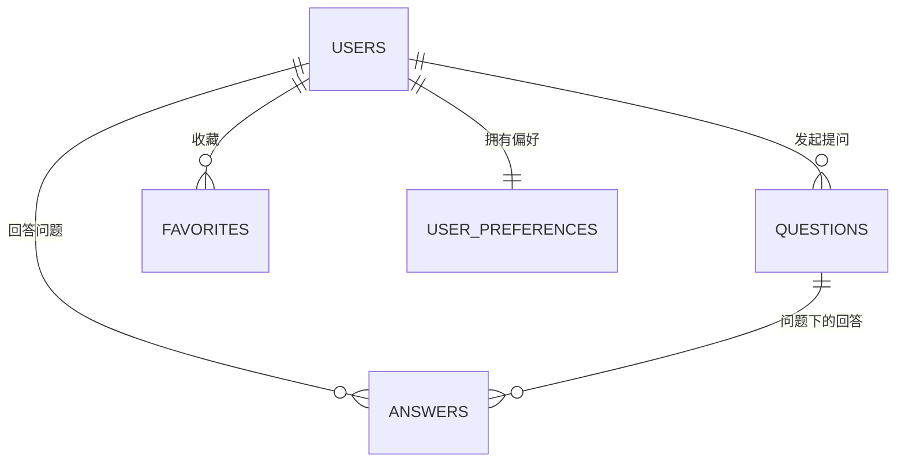

# 引路 · 数据库设计说明书

> **产出人**：P9（数据 B 角 · 后端方向）
> **Day3 起草稿 · Day5（10/2）交稿**
> **这份给谁用**：① P1 写申报书「数据存储设计」章节；② 你后续真的建库时的施工图。
>
> 📌 **国庆这几天你只出设计，不写代码**（部署出错会让 10/3 演示崩掉，风险不值当）。
> **设计文档本身就能写进申报书**，产出是实打实的。

---

## 📖 你要做的事，通俗讲

现在网站的数据全存在**浏览器 localStorage** 里（换台电脑就没了，别人也看不到你的数据）。
你的任务是：**设计一套真正的数据库，让数据存到服务器上。**

不用写 SQL 建表，**把设计图画清楚、讲明白就行。**

---

## 🔑 最重要的底料：现在的 18 个存储键

> 下面这张表是 P1 从 `js/03-config-constants.js` 里扒出来的，
> **每一个键就是未来的一张表**。你从这里出发，不用凭空想。

| localStorage 键 | 存的内容 | 对应未来的表 |
|---|---|---|
| `yinlu_users` | 用户账号 | `users` 用户表 |
| `yinlu_session` | 当前登录的是谁 | （不建表，用 token / Redis） |
| `yinlu_questions` | 提问 | `questions` 问题表 |
| `yinlu_answers` | 回答 | `answers` 回答表 |
| `yinlu_favorites` | 收藏的院校/专业 | `favorites` 收藏表 |
| `yinlu_history` | 浏览历史 | `history` 历史表 |
| `yinlu_candidate_status` | 候选状态 | `candidate_status` 候选表 |
| `yinlu_compare_history` | 对比历史 | `compare_history` 对比记录表 |
| `yinlu_family` | 家庭/家长绑定 | `family` 家庭表 |
| `yinlu_verification` | 认证信息 | `verification` 认证表 |
| `yinlu_decision_events` | 决策日历事件 | `decision_events` 事件表 |
| `yinlu_page_feedback` | 页面反馈 | `page_feedback` 反馈表 |
| `yinlu_theme` | 主题偏好 | 并入 `users` 或 `user_preferences` |
| `yinlu_experience_layout` | 列表/卡片布局 | 同上 |
| `yinlu_pet_position` | 宠物位置 | 同上 |
| `yinlu_pet_avatar` | 宠物形象 | 同上 |
| `yinlu_pet_motion` | 宠物动效开关 | 同上 |
| `yinlu_onboarding_complete` | 新手指引是否看过 | 并入 `users` |

> 💡 **偏好类的 5 个（theme / layout / pet_*）建议合并成一张 `user_preferences` 表**，
> 不要建 5 张小表 —— 这是设计水平的体现，写进文档里。

### 已有字段（真实代码，直接用）

**用户** `users`（来自 `js/18-feature-actions.js`）：
```
id, nickname, email, passwordSalt, passwordHash, role, stage, createdAt
```

**问题** `questions`（来自 `js/18-feature-actions.js`）：
```
id, userId, title, topic, stage, status, createdAt
```

> ⚠️ `passwordHash` 现在是**单次 SHA-256 + 盐**，这个方法在真实后端里不安全。
> **P6 正在改成更合适的方案**，你在文档里要写「密码存储方案由安全组确认」，别自己拍板。

---

## 一、技术选型

> 填一张对比表，然后给结论。**评委喜欢看"你为什么选它"，不喜欢看"大家都在用"。**

| 候选 | 优点 | 缺点 | 我们的情况 |
|---|---|---|---|
| MySQL | 教程最多、学校机房常见 | 要装服务 | |
| PostgreSQL | 功能强、支持 JSON | 稍复杂 | |
| SQLite | 零配置、单文件 | 不适合多人并发 | |
| MongoDB | 跟 JS 数据结构贴近 | 事务支持弱 | |

**我的选择**：__________
**选择理由**（写 2–3 句，重点是"为什么适合我们"）：
```
1.
2.
3.
```

---

## 二、表结构清单

> 每张表填一段。**字段表务必填满「类型」和「说明」两列**，空着等于没设计。

### 2.1 `users` 用户表

| 字段 | 类型 | 约束 | 说明 |
|---|---|---|---|
| `id` | VARCHAR(32) | PK | 用户唯一 ID |
| `nickname` | VARCHAR(50) | NOT NULL | 昵称 |
| `email` | VARCHAR(120) | UNIQUE, NOT NULL | 邮箱，登录用 |
| `password_hash` | VARCHAR(255) | NOT NULL | **由 P6 确认算法** |
| `password_salt` | VARCHAR(255) | NOT NULL | 同上 |
| `role` | VARCHAR(20) | | 学生 / 家长 |
| `stage` | VARCHAR(30) | | 高考志愿 / 考研 / 就业 |
| `created_at` | DATETIME | NOT NULL | |

**你补充的字段**：
```
（比如：头像 avatar_url、就读院校 school_id、意向专业 target_major……）
```

### 2.2 `questions` 问题表

（照 2.1 的格式抄一遍，把上面给的 7 个原始字段先填上，再补充你认为需要的）

| 字段 | 类型 | 约束 | 说明 |
|---|---|---|---|
| | | | |

### 2.3 `answers` 回答表

| 字段 | 类型 | 约束 | 说明 |
|---|---|---|---|
| | | | |
> 提示：至少要有 `question_id` 关联到问题、`user_id` 关联到回答者。

### 2.4 其余表（至少写表名 + 核心字段，不用每张都画满）

```
□ favorites        收藏
□ history          浏览历史
□ candidate_status 候选状态
□ compare_history  对比记录
□ family           家庭绑定
□ verification     认证信息
□ decision_events  决策日历
□ page_feedback    页面反馈
□ user_preferences 偏好设置（合并 5 个 pet/theme 键）
```

---

## 三、表关系（ER 图）

> 用 **mermaid** 语法写（GitHub 能直接渲染成图，很加分）。
> 不会写就照着下面改。



**关系说明**（用中文讲一遍谁和谁是一对多）：
```
1.
2.
3.
```

---

## 四、索引设计

> 原则：**给经常用来查询 / 排序的字段建索引**。写清楚为什么。

| 表 | 索引字段 | 为什么建 |
|---|---|---|
| `users` | `email` | 登录时要按邮箱查，且必须唯一 |
| `questions` | `created_at` | 列表按时间倒序 |
| `answers` | `question_id` | 打开一个问题要列出它所有回答 |
| | | |

---

## 五、安全考虑

> 🔴 **这部分跟 P6 强相关，务必先找他对齐再写。**
> 在群里 @ P6：「密码存储最终定什么方案？我在写数据库设计。」

| 风险 | 应对措施 |
|---|---|
| 密码泄露 | 🔴 **等 P6 确认方案后填**（现在是 SHA-256，不合规） |
| SQL 注入 | 统一用参数化查询，不拼接 SQL |
| 越权看别人的数据 | 每个接口都要校验 `user_id` 是不是本人 |
| 敏感信息（邮箱）泄露 | 接口返回时脱敏 |
| | |

---

## 六、后续计划（国庆之后）

> 写下"什么时候真的动手"。这部分能体现你有规划。

```
□ 10 月下旬：搭第一个接口（用户注册/登录）
□ 11 月：数据迁移脚本（把 localStorage 数据搬到数据库）
□ 11 月：院校数据入库
□ 待定：部署上线
```

---

## 七、交稿前自检

```
□ 18 个存储键都处置到位了（有对应去处，没漏）
□ 每张核心表的字段都填了「类型」和「说明」
□ ER 图画了，且能看懂
□ 索引写了「为什么」
□ 安全部分找 P6 对过了
□ 保存为 docs/数据库设计说明书.md 并 @ P1、P6
```

---

## 八、需要 `docs/功能清单.md` 的时候

> P5 在 Day2 写《功能清单》，**里面有账户部分的完整字段**。
> 想不通"账号还要存哪些字段"，直接去 `docs/功能清单.md` 查，或群里 @ P5。
